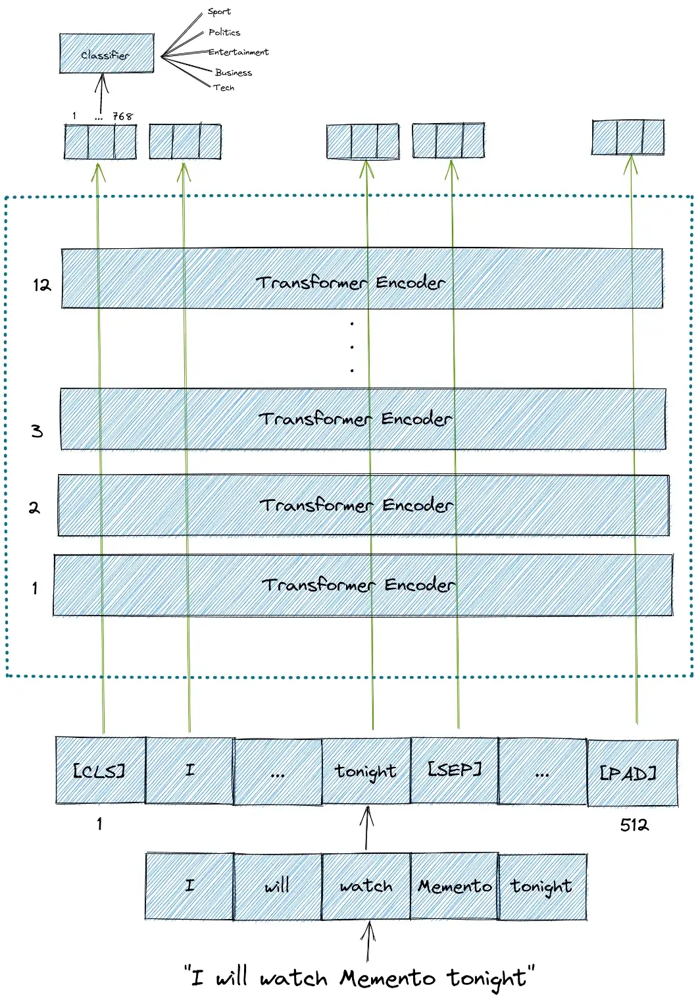
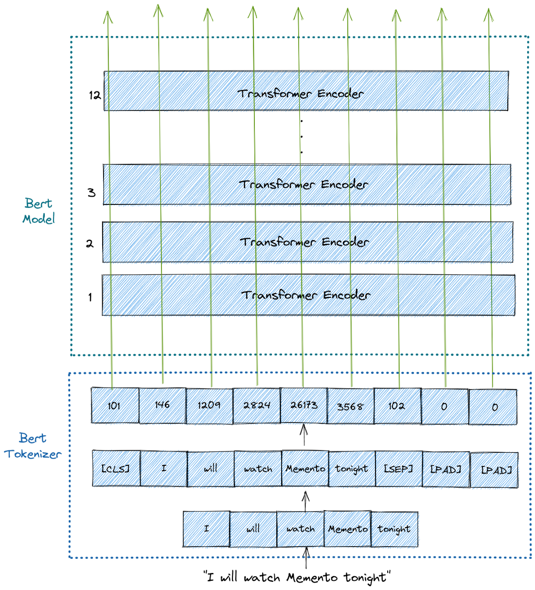

# Finetune BERT for Text Classifier
## Goal
I made this project to get used with using `transformer` module for finetune model easily.<br>
Learn how to write a code for finetune BERT for **Text Classification Task**.<br>

---
## Overview of BERT


----
## How BERT Tokenizer work


----
## Requirements
- `transformers`
- `pytorch`
- `numpy`
- `pandas`


----
## How to run
```
$ python train.py --lr 1e-6 --epochs 5
```

## Reference
- [Text Classification with BERT in PyTorch](https://towardsdatascience.com/text-classification-with-bert-in-pytorch-887965e5820f)
- [How do I save a trained model in PyTorch?](https://stackoverflow.com/questions/42703500/how-do-i-save-a-trained-model-in-pytorch)